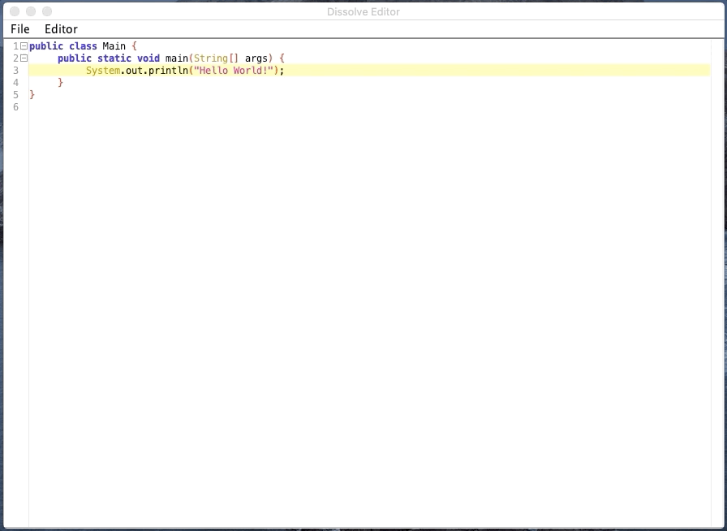

# Dissolve

### Dissolve is a code editor written in Java. This is my independent final project for AP Computer Science A.

## Installation

_Note: Due to outside Maven dependencies, I was not able to build my project into a .jar file, it threw a bunch of weird errors_

### Requirements

- [Maven](https://maven.apache.org/)
- [JDK 8+](https://www.oracle.com/java/technologies/javase-downloads.html)

#### Don't know how to install maven? Click [here](https://www.baeldung.com/install-maven-on-windows-linux-mac)

Clone the repository

```
git clone https://github.com/taylorallen0913/dissolve
```

Enter the repository

```
cd dissolve
```

Compile & run project

```
mvn clean compile exec:java
```

## User Manual

### Creating a project:


### Running code:


